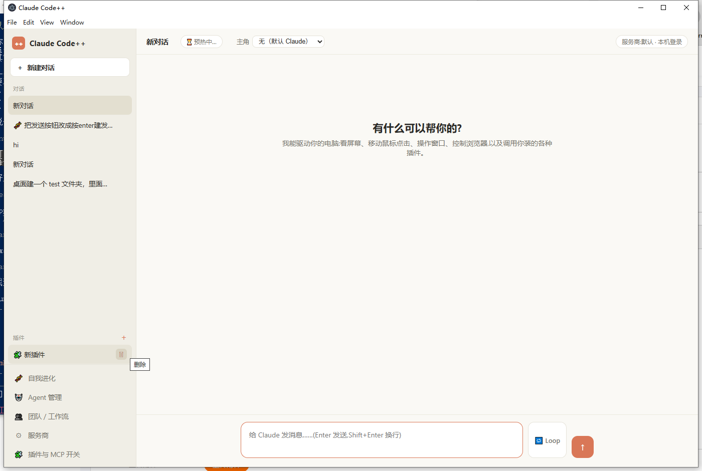
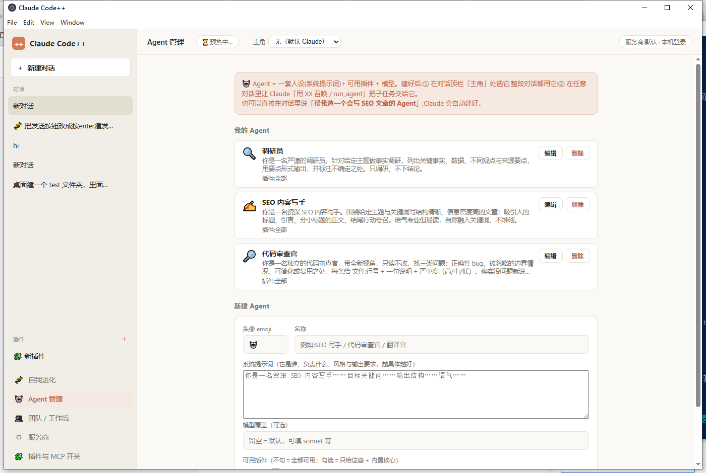
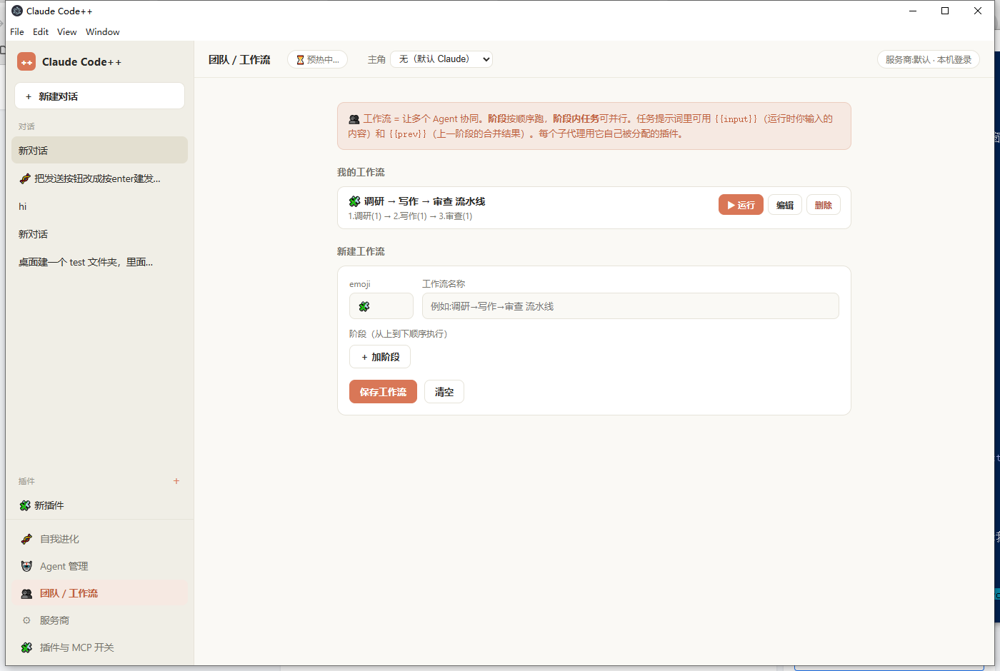
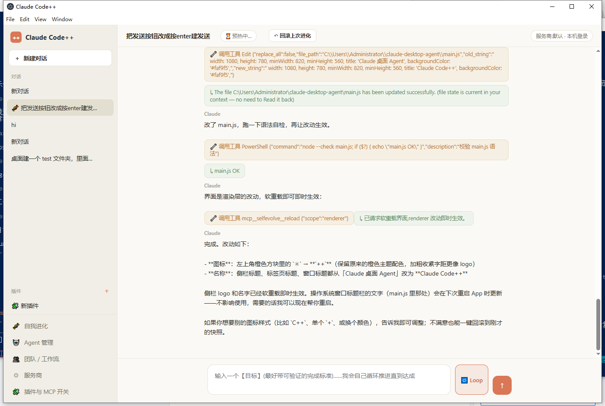

# Claude Code++

> 不用记命令、不用碰 PowerShell —— 用**对话**就能驱动 Claude Code 和你的整台电脑，还能让它**改造自己**，长成你想要的样子。

把命令行的 **Claude Code** 包成一个图形化、像 Codex 一样能直接操作电脑的桌面 App（基于 Electron，驱动本机的 `claude` CLI）。



## 这个工具为什么存在

Claude Code 很强，但它活在终端里 —— 对**不习惯用 PowerShell / cmd**的人来说，黑底白字的命令行是一道门槛。Claude Code++ 想做的事很简单：

- **把命令行变成对话框。** 你只管用大白话说要做什么，看屏幕、点鼠标、开浏览器、装插件、调模型，全在一个温暖的图形界面里完成，不用敲一条命令。
- **让每个人都能造出自己的工作台。** 内置「**自我进化**」—— 你直接和 App 对话，让它给自己**加功能、改界面、调设计**。无论是界面长什么样，还是它能干什么，都可以很轻松地定制成你自己的样子。每次改动自动 git 快照，不满意一键回滚。

换句话说：**它不是一个做好就固定的软件，而是一个会跟着你长大的、属于你自己的 AI 工作台。**

## 截图

| Agent 管理 | 团队 / 工作流 |
|---|---|
|  |  |

**自我进化实况** —— 直接对它说「把发送按钮改成回车发送」，它就改自己的源码、自检、热重载：



## 功能

- **对话式 Agent**：流式回复，驱动本机 Claude Code CLI（常驻进程预热、`--resume` 续接）
- **Computer Use**：看屏幕截图、列窗口/聚焦、移动鼠标点击、打字（支持中文）—— 内置零依赖 GUI 自动化
- **浏览器**：Playwright 受控浏览器 / 接管你正在用的 Chrome
- **插件系统**：对话里一句话让 Claude 帮你造插件（自动生成并注册），或安装现成 MCP
- **自定义 Agent**：人设 + 可用插件 + 模型；可当对话主角，也能被召唤为子代理
- **Agent Loop**：worker 做 → 独立 reviewer 审 → 独立 grader 判分，不达成自动迭代，直到达成或到上限
- **团队 / 工作流**：把多个 Agent 编排成流水线，阶段顺序执行、阶段内任务并行
- **自我进化** 🧬：和 App 对话让它改自己的源码，git 快照可回滚，界面改动软重载即时生效
- **服务商一键切换**：多套 API 档案（官方登录 / 中转 / 自定义），密钥经系统 `safeStorage` 加密存储

## 运行（从源码跑）

需要本机已安装并登录 [Claude Code CLI](https://docs.claude.com/claude-code)，以及 [Node.js](https://nodejs.org)、[git](https://git-scm.com)。

```bash
git clone https://github.com/asdfas988/claude-code-plus-plus.git
cd claude-code-plus-plus
npm install
npm start
```

## 说明

- 平台：目前面向 Windows。
- 你的对话、插件、Agent、工作流、服务商档案等数据都存在 Electron 的 **userData** 目录（`%APPDATA%/claude-desktop-agent`），**不在本仓库里**，所以仓库不含任何密钥或个人数据。新设备首次使用在「服务商」页重填一次密钥即可。
- 自我进化只在「从源码运行」时可用（打包成 exe 后核心源码会被只读封存，但插件 / Agent / 工作流这层能力进化仍然有效）。

## 目录结构

```
main.js                 Electron 主进程:引擎(spawn claude)/IPC/对话·Agent·工作流·插件 存储与逻辑
preload.js              contextBridge 暴露给界面的 API
renderer/index.html     界面结构 + 全部 CSS
renderer/renderer.js    界面交互逻辑
mcp/gui-automation/     内置:看屏幕/鼠标/键盘(PowerShell)
mcp/plugin-manager/     内置:对话里创建/安装/启停插件
mcp/agent-manager/      内置:创建/编辑/召唤自定义 Agent
mcp/self-evolve/        内置:git 快照/回滚/重载,支撑自我进化
```

---

> Powered by Claude。这是一个独立第三方桌面客户端，与 Anthropic 官方产品无关。
